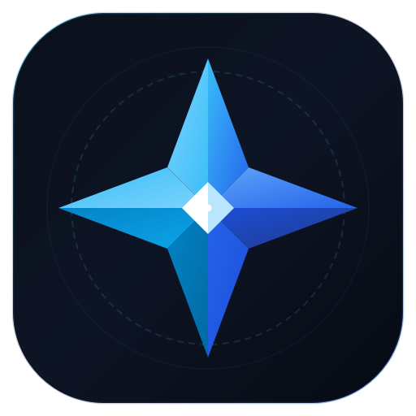

# Polaris: Privacy-First AI Desktop Workspace & File Organizer

<p align="center">
  
</p>

<p align="center">
  <b>100% Offline · Zero Cloud Telemetry · Local LLMs via Ollama · Hybrid FAISS + BM25 Retrieval</b>
</p>

<p align="center">
  <a href="#3-core-capabilities">Features</a> •
  <a href="#quick-start--installation">Quick Start</a> •
  <a href="#architecture--design-system">Design System</a> •
  <a href="#launch-video--media">Launch Video</a> •
  <a href="#automated-test-suite">Tests</a> •
  <a href="#documentation">Documentation</a>
</p>

---

Polaris is an offline-first desktop AI studio built with **PySide6** and powered completely on-device by **Ollama**. No cloud calls, zero external API keys, zero subscription fees, and zero data leakage.

Designed for standard laptops and workstations (including CPU-only machines with 8 GB RAM), Polaris unites intelligent file categorization, grounded multi-turn document chat, and executive summarization into a unified **Obsidian dark card-based interface**.

---

## 3 Core Capabilities

### 1. 📁 AI-Powered File Organizing & Live Watcher
- **Natural Language Sorting**: Direct the AI using freeform English (*"Sort invoices by year and vendor"*, *"Group papers by topic and size brackets"*), or use one-click presets like *Type then Size* or *Smart Auto-Group*.
- **Download Watcher Daemon**: Optional real-time folder monitoring (e.g. `Downloads/`). Detects newly saved files and displays non-intrusive **Suggestion Toasts** with 1-click apply.
- **Interactive Preview Table**:
  - Double-click destination cells to edit target paths in-place.
  - Live search filter box to instantly isolate specific files in large batches.
  - Toggle between **Move Mode** and **Copy Mode** non-destructively.
- **Deterministic Collision Avoidance**: Automatically appends incremental suffixes (`(1)`, `(2)`) so files are **never overwritten**.
- **1-Click Transactional Undo**: Every batch is recorded in SQLite and can be restored to its exact original location at any time.

### 2. 💬 Grounded AI Search & Document Chat (Hybrid RAG)
- **Multi-Format Ingestion**: Extracts text with page tracking from **PDFs** (via `PyMuPDF`), **Word Documents** (`.docx`), **Markdown**, **Plain Text**, and **Source Code**.
- **Hybrid Retrieval (FAISS + BM25)**: Combines dense vector embeddings (`nomic-embed-text`) with Okapi BM25 and SQLite FTS5 lexical search using **Reciprocal Rank Fusion (RRF)**.
- **HyDE & Cross-Encoder Re-Ranking**:
  - **HyDE (Hypothetical Document Embeddings)**: Generates hypothetical answers to maximize semantic recall.
  - **Cross-Encoder Re-Ranking**: Scores candidates against query terms and section titles for high precision.
- **Interactive Citation Badges & Deep-Linking**:
  - Grounded citations (e.g. `📄 [1] audit_report.pdf (Page 2) § Revenue [Line 42]`).
  - Click any badge to open the **Source Inspector Dialog** with highlighted text snippets.
  - One-click deep link jumps straight to the exact line number in **VS Code**, **Cursor**, or **Sublime Text**.
- **Real-Time Token Streaming**: Messenger-style compact chat bubbles with live token streaming and Markdown formatting.
- **Session Export**: Export chat history and verified citations to structured Markdown files.

### 3. 📝 Executive Document Summarizer & Entity Extraction
- **Multi-Mode Summarization**: Generate *Key Takeaways & Action Items* (bullets), *Executive Summary* (concise brief), or *Technical Breakdown*.
- **Structured JSON Entity Extraction**: Extracts structured fields (contract IDs, dates, vendor names, currency amounts) validated against schemas.
- **CPU-Tuned Context**: Prioritized excerpting ensures multi-page documents process in seconds on CPU without memory bloat.
- **1-Click Clipboard Export**: Formatted Markdown display with instant copy actions.

---

## Architecture & Design System

Polaris features a custom, distraction-free **Obsidian Card UI**:
- **Color Palette**: Dark Slate background (`#0d1117`), Elevated Cards (`#161b22`), Subtle Borders (`#30363d`), Electric Blue accents (`#1f6feb`, `#58a6ff`), and Emerald success indicators (`#238636`, `#4ade80`).
- **Brand Identity**: Custom geometric 8-point compass star emblem rendered in multi-resolution SVG and PNG.
- **Navigation**: Clean pill tab navigation bar, suggested prompt chips, and responsive split-views.

---

## Quick Start & Installation

### 1. Environment Setup
```powershell
# Create and activate virtual environment
python -m venv .venv
.\.venv\Scripts\Activate.ps1

# Install Polaris in editable mode with dependencies
pip install -e ".[dev,docs,search]"
```

### 2. Local AI Setup (via Ollama)
Install Ollama from [ollama.com](https://ollama.com), then pull the lightweight recommended models:
```powershell
# Fast local LLM (~986 MB, ~35-50 tok/s on CPU)
ollama pull qwen2.5:1.5b

# High-quality embedding model (~274 MB)
ollama pull nomic-embed-text

# (Optional) Higher-parameter model for 16GB+ systems
ollama pull llama3.2:3b
```

### 3. Launch Application
```powershell
python -m polaris
# or:
polaris
```

*(You can toggle between local models live via the **🧠 Model** dropdown in the top-right corner of the application window).*

---

## Trying the Included Demo Dataset

A sample folder is included at `sample_files/` containing 10 varied documents:
- `q3_financial_performance_report.md` (Financial report with revenue figures)
- `invoice_acme_corp_nov2024.txt` (Hardware server invoice)
- `receipt_delta_airlines_oct2024.txt` (Travel expense receipt)
- `quarterly_budget_2024.csv` (Departmental budget spreadsheet)
- `nda_quantum_ventures.txt` (Legal confidentiality contract)
- `project_apollo_architecture_spec.md` (Engineering architecture spec)
- `clean_customer_records.py` (Data pipeline script)
- `backup_server_logs_2024.zip` (Archive file)
- `vacation_beach_sunset.png` & `family_reunion_2023.jpg` (Sample media)

**Recommended test workflows:**
1. In **📁 Organize**: Select `sample_files`, click **Smart Auto-Group**, review preview table, click **Apply**, and test **Undo**.
2. In **💬 Search & Chat**: Select `sample_files`, click **⚡ Index Folder**, and ask: *"What was the total revenue in the Q3 report?"* or *"When does the NDA expire?"*. Inspect citations by clicking badge `[1]`.
3. In **📝 Summarize**: Select `sample_files/q3_financial_performance_report.md` and generate an **Executive Summary**.

---

```

```text
======================== 91 passed in 84.35s ========================
```
- `tests/test_core.py`: Safety checks, incremental naming, duplicate detection.
- `tests/test_organize.py`: Destination editing, watcher triggers, copy/move modes, toast notifications.
- `tests/test_rag.py`: BM25, FAISS vector indexing, HyDE, RRF fusion, FTS5 search, source viewer dialog.
- `tests/test_ui.py`: Window initialization, card styling, messenger bubble formatting, model switching.

---

## Documentation
* [docs/TEAM_ROLES_WORKFLOW.md](docs/TEAM_ROLES_WORKFLOW.md) — Simultaneous collaboration guide, developer roles, and git workflow.
* [docs/FEATURES.md](docs/FEATURES.md) — Comprehensive guide to all core features, safety guarantees, and settings.
* [docs/DEVELOPMENT_LOG.md](docs/DEVELOPMENT_LOG.md) — Technical history of bug fixes, architecture evolution, and CPU tuning.
* [docs/PLAN.md](docs/PLAN.md) — High-level architecture and hardware design guidelines.

---

## License

Open Source under the [MIT License](LICENSE).
